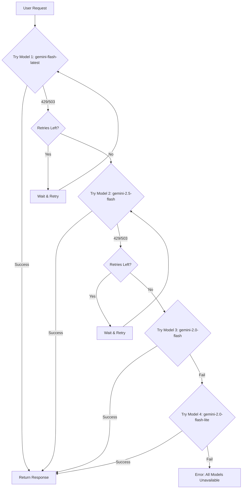
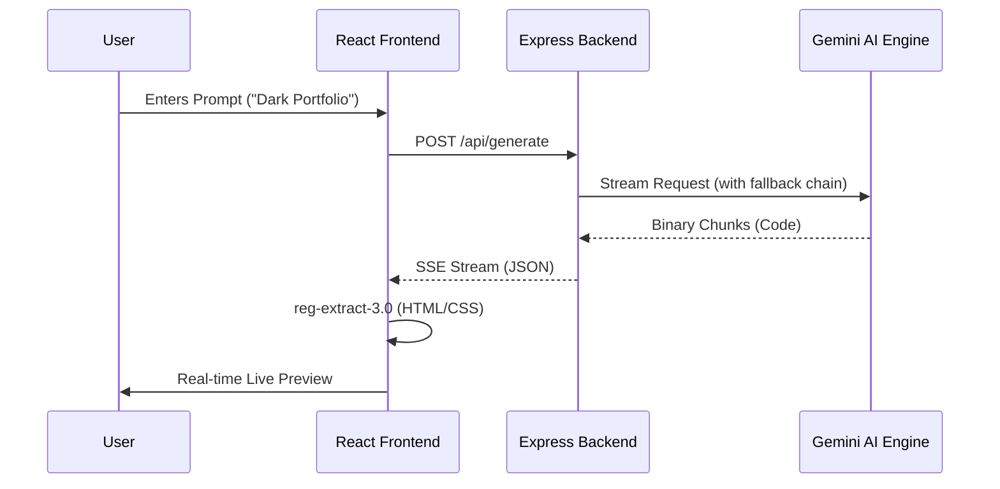

# Technical Architecture & System Design

NEXUS AI is built on a distributed logic model that separates high-latency AI generation from low-latency UI rendering.

## 📡 Code Streaming Lifecycle

The system utilizes a unidirectional data flow for real-time website updates:

1.  **Orchestration layer**: `server/server.js` receives the prompt and routes it through the model fallback chain (see below).
2.  **Streaming layer**: The AI service (`geminiService.js`) initializes a `generateContentStream` with a specialized system instruction using Gemini Flash models optimized for speed.
3.  **Parsing layer (`reg-extract-3.0`)**: The client-side `StreamingLivePreview` uses non-blocking regex lookaheads to extract valid HTML/CSS fragments from the binary stream.
4.  **Sandbox layer**: The `LiveRenderer` injects the sanitized code into a isolated `null-origin` iframe.

## 🤖 Model Fallback Chain & Resilience Strategy

The system implements a multi-model fallback chain with automatic retry logic to ensure maximum uptime and reliability. This is a deliberate architectural decision — **Gemini Flash models were chosen over Pro models** for the following reasons:

| Factor | Flash (Current) | Pro (Alternative) |
| :--- | :--- | :--- |
| Streaming Speed | ⚡ Significantly faster | Slower response time |
| Free Tier Rate Limit | ~15 RPM | ~2 RPM |
| HTML/CSS Quality | Excellent for code generation | Marginal improvement |
| User Experience | Real-time live preview feel | Noticeable latency |

### Fallback Order

The system tries models in the following priority order, falling back automatically on failure:

```
gemini-flash-latest → gemini-2.5-flash → gemini-2.0-flash → gemini-2.0-flash-lite
```

### Retry Logic

For each model in the chain:
1. **Attempt the request** up to 3 times with exponential backoff (3s, 6s, 9s)
2. **On `429` (Rate Limited)** or **`503` (Overloaded)** → retry with delay, then fall back to the next model
3. **On other errors** → throw immediately (no retry)
4. **If all models exhausted** → return a user-friendly error message



## 🏗️ Internal Tooling & Modules

| Module ID | Responsibility | Technical Stack |
| :--- | :--- | :--- |
| `nexus-sse-01` | Server-Sent-Events Gateway | Node.js / Express / stream-polyfill |
| `nexus-parser-v2` | Real-time Regex Extraction Engine | JavaScript / ES6 Regex / Buffer-Queue |
| `nexus-ui-glass` | Premium Glassmorphism Design System | Tailwind CSS / Framer Motion / CSS Glass |
| `nexus-iso-render` | Secure Sandboxed Iframe Renderer | React / Iframe-API / Blob-URL-Targeting |

## 🔄 Interaction Sequence



## 🔒 Security Architecture

- **Context Isolation**: Generated code is rendered in an `<iframe>` with `sandbox="allow-scripts"` to prevent parent DOM access.
- **Environment Scrubbing**: The `.env` protection layer ensures that production keys are never exposed to the client-side bundle via deterministic CI/CD blocking.

---

## 📝 Changelog

### v1.1 — Model Architecture Update (April 2026)

**What changed:** Replaced references to `Gemini 1.5/2.5 Pro` with the actual Gemini Flash models used in the codebase, and added comprehensive documentation for the Model Fallback Chain.

**Why:** The original documentation referenced Gemini Pro models, but the codebase was intentionally built with **Gemini Flash models** for optimal performance. Flash models provide significantly faster streaming output and higher rate limits (15 RPM vs 2 RPM), which is critical for the real-time live preview experience that defines NEXUS AI. The quality difference for HTML/CSS code generation is negligible, making Flash the superior choice for this use case. The fallback chain ensures resilience by automatically cycling through multiple Flash model variants if the primary model is unavailable.
