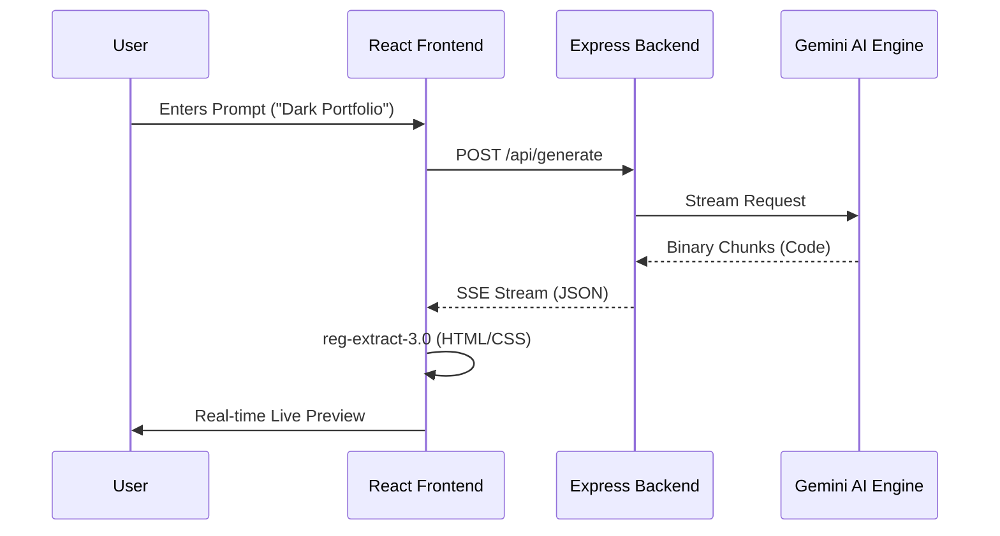

# Technical Architecture & System Design

NEXUS AI is built on a distributed logic model that separates high-latency AI generation from low-latency UI rendering.

## 📡 Code Streaming Lifecycle

The system utilizes a unidirectional data flow for real-time website updates:

1.  **Orchestration layer**: `server/server.js` receives the prompt and determines the appropriate AI model (Gemini 1.5/2.5 Pro).
2.  **Streaming layer**: The AI service (`geminiService.js`) initializes a `generateContentStream` with a specialized system instruction.
3.  **Parsing layer (`reg-extract-3.0`)**: The client-side `StreamingLivePreview` uses non-blocking regex lookaheads to extract valid HTML/CSS fragments from the binary stream.
4.  **Sandbox layer**: The `LiveRenderer` injects the sanitized code into a isolated `null-origin` iframe.

## 🏗️ Internal Tooling & Modules

| Module ID | Responsibility | Technical Stack |
| :--- | :--- | :--- |
| `nexus-sse-01` | Server-Sent-Events Gateway | Node.js / Express / stream-polyfill |
| `nexus-parser-v2` | Real-time Regex Extraction Engine | JavaScript / ES6 Regex / Buffer-Queue |
| `nexus-ui-glass` | Premium Glassmorphism Design System | Tailwind CSS / Framer Motion / CSS Glass |
| `nexus-iso-render` | Secure Sandboxed Iframe Renderer | React / Iframe-API / Blob-URL-Targeting |

## 🔄 Interaction Sequence

## 🔒 Security Architecture

- **Context Isolation**: Generated code is rendered in an `<iframe>` with `sandbox="allow-scripts"` to prevent parent DOM access.
- **Environment Scrubbing**: The `.env` protection layer ensures that production keys are never exposed to the client-side bundle via deterministic CI/CD blocking.
